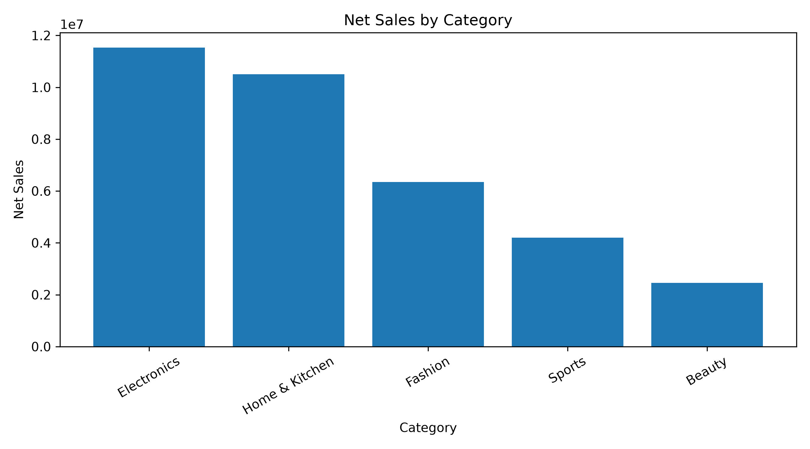
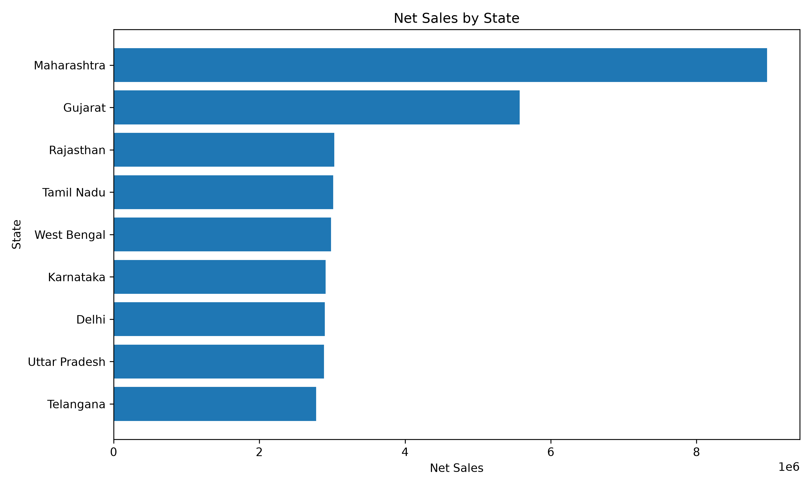
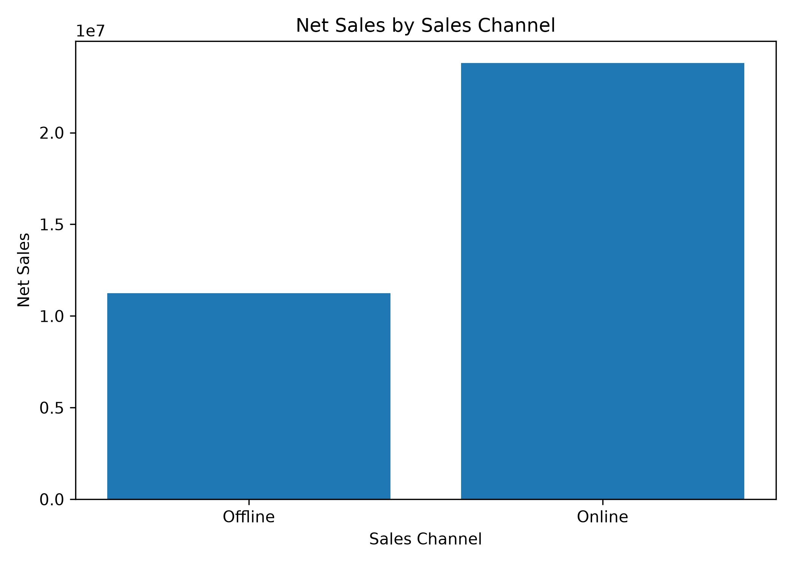

# E-Commerce Sales & Customer Analytics

## 📌 Project Overview

This project analyzes e-commerce sales data to identify key business trends across revenue, customers, products, categories, geography, sales channels, discounts, and payment methods.

The project uses Python-based exploratory data analysis to convert raw transaction data into actionable business insights.

---

## 🎯 Business Questions

The analysis focuses on the following questions:

- What is the overall sales and order performance?
- Which product categories generate the most revenue?
- Which products are the top revenue contributors?
- Which states contribute the most sales?
- How do Online and Offline channels compare?
- How has business performance changed between 2024 and 2025?
- What is the relationship between discounts and Average Order Value?
- Which payment methods are most commonly used?
- What customer purchasing patterns can be identified?

---

## 🛠️ Tools & Technologies

- Python
- Pandas
- NumPy
- Matplotlib
- Jupyter Notebook

---

## 📊 Dataset

The dataset contains e-commerce transaction-level information including:

- Order details
- Customer information
- Product information
- Category
- Geographic information
- Quantity
- Unit price
- Discount percentage
- Payment method
- Sales channel
- Customer rating
- Gross sales
- Net sales

### Dataset Size

- **Original Records:** 8,020
- **Records after cleaning:** 8,000
- **Columns:** 18
- **Unique Orders:** 8,000
- **Unique Customers:** 1,490

---

## 🧹 Data Cleaning

The following cleaning steps were performed:

1. Identified and removed 20 duplicate records.
2. Identified 20 missing Payment Method values.
3. Replaced missing Payment Method values with `Unknown`.
4. Retained 20 missing Customer Rating values because no reliable replacement value was available.
5. Converted `Order_Date` from string format to datetime format.
6. Performed final validation to confirm data quality.

---

## 📈 Analysis Performed

### Overall Sales Performance

- Total Net Sales
- Total Orders
- Total Customers
- Average Order Value

### Category Analysis

- Revenue by category
- Quantity sold by category
- Average unit price by category

### Customer Analysis

- Orders per customer
- Repeat customers
- Repeat customer rate
- Order frequency

### Geographical Analysis

- Revenue by state
- Revenue contribution by state
- Top-performing state

### Sales Channel Analysis

- Orders by channel
- Revenue by channel
- Average Order Value by channel
- Revenue share by channel

### Time-Based Analysis

- Monthly revenue
- Monthly order volume
- Yearly revenue
- Yearly orders
- Yearly AOV
- Year-over-year growth

### Product Analysis

- Top 10 products by revenue
- Top 10 products by quantity

### Discount Analysis

- Revenue by discount level
- Orders by discount level
- Average Order Value by discount level

### Customer Rating Analysis

- Average customer rating by category

### Payment Analysis

- Orders by payment method
- Revenue by payment method

---
## 📊 Visualizations

### Revenue by Category



### Revenue by State



### Monthly Revenue Trend


### Revenue by Sales Channel



### Top 10 Products by Revenue


### Discount vs Average Order Value


---

# 🔑 Key Business Insights

### 1. Strong Overall Sales Performance

The business generated approximately **₹3.51 crore in net sales** across **8,000 orders**, with an Average Order Value of approximately **₹4,388.72**.

### 2. Strong Customer Retention

The analysis identified **1,459 repeat customers out of 1,490 customers**, resulting in a repeat customer rate of approximately **97.92%**.

### 3. Electronics is the Leading Category

Electronics generated approximately **₹1.16 crore** in net sales, making it the highest-revenue category.

### 4. Maharashtra is the Largest Market

Maharashtra generated approximately **₹89.85 lakh**, contributing approximately **25.59% of total net sales**.

### 5. Online is the Dominant Sales Channel

Online generated **5,415 orders**, compared with **2,585 offline orders**, indicating significantly higher transaction volume through the online channel.

### 6. Smart Watch is the Top Revenue Product

Smart Watch generated approximately **₹42.77 lakh** in net sales, making it the highest-revenue product in the dataset.

### 7. Higher Discounts are Associated with Lower AOV

Average Order Value decreased from approximately **₹4,821 at 0% discount** to **₹3,516.90 at 25% discount**.

This represents an observed association rather than proof of causation.

### 8. 2025 Performance Remained Broadly Stable

Compared with 2024:

- Revenue declined by **0.64%**
- Orders declined by **0.40%**
- AOV declined by **0.24%**

The business therefore remained broadly stable year-over-year.

---

# 💡 Business Recommendations

### 1. Strengthen High-Performing Categories

Continue investing in Electronics and Home & Kitchen while identifying opportunities to improve lower-performing categories.

### 2. Optimize the Online Channel

Given the significantly higher online order volume, the business should continue improving online conversion, customer experience, and retention.

### 3. Expand Geographic Reach

Maharashtra is a major contributor to revenue. The business should explore opportunities to increase penetration in lower-performing states while maintaining its position in established markets.

### 4. Optimize Discounting

Discounts should be targeted toward specific customer segments and products rather than applied broadly. Promotional campaigns should be evaluated based on incremental revenue and profitability.

### 5. Leverage High-Performing Products

Products such as Smart Watches, Air Fryers, and Bluetooth Speakers could be prioritized for cross-selling, bundling, and inventory planning.

### 6. Protect Customer Retention

The high repeat-customer rate indicates strong customer engagement. Loyalty programs and personalized offers could help maintain this customer base.

### 7. Monitor Growth

Although 2025 performance was broadly stable, management should monitor category, product, channel, and geographic trends to identify opportunities for renewed growth.

---

# 📁 Project Structure

```text
retail-sales-analytics/
│
├── data/
│   └── ecommerce_sales.csv
│
├── notebooks/
│   └── ecommerce_sales_analysis_final.ipynb
│
├── visualizations/
│
├── README.md
│
└── requirements.txt