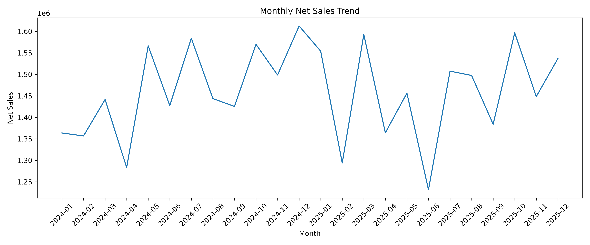
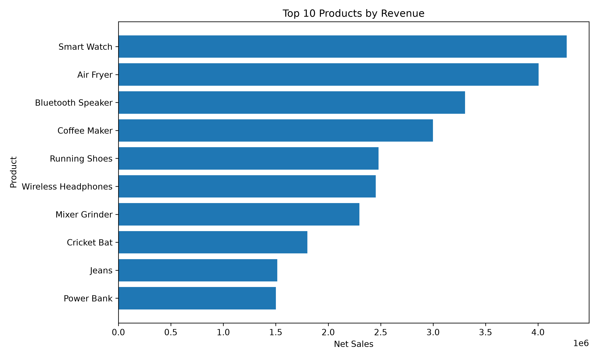
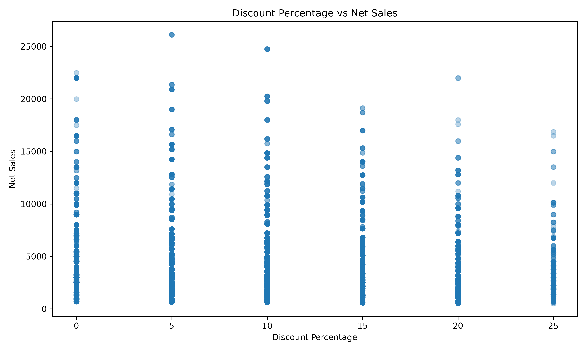

# E-Commerce Sales & Customer Analytics

A Python-based analysis of an e-commerce sales dataset covering customers, products, categories, locations, discounts, sales channels, and payment methods.

I used Python to clean the data, explore sales patterns, compare different parts of the business, and identify a few areas that are worth looking at from a business perspective.

---

## Key Metrics

| Metric | Value |
|---|---:|
| Net Sales | ₹3.51 Cr |
| Total Orders | 8,000 |
| Unique Customers | 1,490 |
| Average Order Value | ₹4,388.72 |
| Repeat Customers | 1,459 |
| Repeat Customer Rate | 97.92% |

---

## What I Wanted to Understand

The analysis was built around a few practical questions:

- How is the business performing overall?
- Which categories and products contribute the most revenue?
- Which states are the strongest markets?
- How different are Online and Offline sales?
- What changed between 2024 and 2025?
- Is there any visible relationship between discounts and order value?
- Which payment methods are used most often?
- What does the customer data tell us about repeat purchasing?

---

## Tools Used

- Python
- Pandas
- NumPy
- Matplotlib
- Jupyter Notebook

---

## Dataset

The dataset contains e-commerce transaction data across:

- Order and customer details
- Products and categories
- City and State
- Quantity and Unit Price
- Discount Percentage
- Payment Method
- Sales Channel
- Customer Rating
- Gross Sales
- Net Sales

### Dataset Size

- Original records: **8,020**
- Records after cleaning: **8,000**
- Columns: **18**
- Unique Order IDs: **8,000**
- Unique Customers: **1,490**

---

## Data Cleaning

Before starting the analysis, I performed a basic data-quality check and prepared the dataset for analysis.

The main steps were:

1. Removed **20 duplicate records**.
2. Identified **20 missing Payment Method values**.
3. Replaced missing payment methods with `Unknown`.
4. Kept missing Customer Rating values where there was no reliable value to replace them with.
5. Converted `Order_Date` into datetime format.
6. Performed a final validation of the cleaned dataset.

---

## Analysis

### Sales Performance

- Total net sales
- Total orders
- Unique customers
- Average Order Value
- Yearly sales performance
- Year-over-year growth

### Customer Analysis

- Orders per customer
- Repeat customers
- Repeat customer rate
- Customer order frequency

### Product & Category Analysis

- Revenue by category
- Quantity sold by category
- Average unit price by category
- Top 10 products by revenue
- Top 10 products by quantity

### Geographic Analysis

- Revenue by state
- State contribution to total sales
- Top-performing states

### Sales Channel Analysis

- Orders by channel
- Revenue by channel
- Average Order Value by channel

### Time Analysis

- Monthly revenue
- Monthly order volume
- Yearly revenue
- Yearly orders
- Yearly AOV
- Year-over-year revenue growth

### Discount Analysis

- Revenue by discount level
- Orders by discount level
- Average Order Value by discount level

### Customer Ratings

- Average customer rating by category

### Payment Methods

- Orders by payment method
- Revenue by payment method

---

# Key Findings

A few findings stood out during the analysis.

### 1. The business generated ₹3.51 crore in net sales

The dataset contains **8,000 orders** from **1,490 customers**, with an average order value of **₹4,388.72**.

### 2. Most customers placed repeat orders

There were **1,459 repeat customers**, giving a repeat customer rate of **97.92%**.

This is unusually high, so it is something I would want to investigate further rather than automatically treating it as a sign of strong customer loyalty.

### 3. Electronics was the largest revenue category

Electronics generated approximately **₹1.16 crore** in net sales and was the highest-revenue category in the dataset.

### 4. Maharashtra was the largest state market

Maharashtra contributed approximately **₹89.85 lakh**, or around **25.59% of total net sales**.

### 5. Online sales accounted for most orders

The Online channel recorded **5,415 orders**, compared with **2,585 Offline orders**.

This makes Online the dominant channel by transaction volume.

### 6. Smart Watch was the top revenue-generating product

Smart Watch generated approximately **₹42.77 lakh** in net sales, making it the highest-revenue product in the dataset.

### 7. Higher discount levels showed lower AOV

Average Order Value fell from approximately **₹4,821 at 0% discount** to **₹3,516.90 at 25% discount**.

This is an observed relationship in the dataset and should not be interpreted as proof that discounts directly caused the lower AOV.

### 8. 2025 was broadly flat compared with 2024

Compared with 2024:

- Revenue declined by **0.64%**
- Orders declined by **0.40%**
- AOV declined by **0.24%**

So overall sales performance remained relatively stable rather than showing significant growth or decline.

---

# What These Findings Suggest

Based on the analysis, a few areas stood out for further investigation:

- **Electronics and other high-revenue categories** could be studied further for product-level opportunities.
- The large contribution from **Maharashtra** suggests there may be scope to understand what is driving performance there and whether similar patterns exist in other states.
- The strong Online channel could be examined for differences in customer behaviour and basket size.
- The relationship between **discounting and AOV** suggests that blanket discounting may not always produce larger baskets.
- The very high repeat-customer rate should be validated against the underlying order structure before being used as a strong retention claim.
- Since 2025 revenue was almost flat, category, product, and channel-level changes may provide more useful signals than looking only at total yearly revenue.

---

# Visualizations

### Revenue by Category

### Revenue by State

### Revenue by Sales Channel

### Monthly Sales Trend

### Top Products by Revenue

### Discount vs Sales

---

# Project Structure

